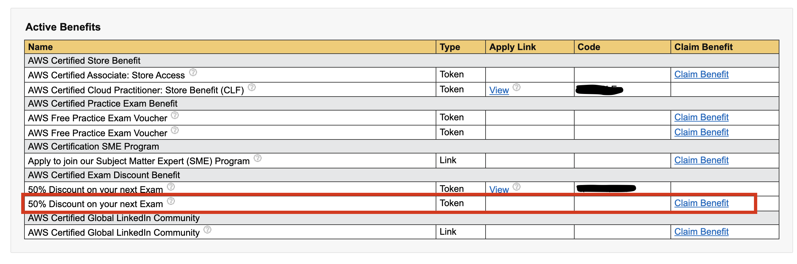

It has been a while since I passed the [AWS Certified Developer Associate exam](https://aws.amazon.com/certification/certified-developer-associate/), but I took a longer holiday, 
so I haven't had the chance to share some tips with others attempting this exam. 
Studying for the exam besides work using my precious free time, I learnt a couple of things that allowed me to succeed.

## Finding an efficient way to study is vital
When you start studying for the developer associate exam, the amount of information may be overwhelming at times. 
The exam expects you to have developed a strong understanding of various knowledge areas such as **Development** with AWS services,
**Refactoring**, **Security**, **Deployment**, **Monitoring** and **Troubleshooting**. As I've mentioned in [previous Weeknotes](https://c-gyorfi.github.io/blog/weeknotes-04/), 
I followed a Udemy course to go through all the services. The exam has a strong focus on AWS's serverless offerings such as [Lambda](https://aws.amazon.com/lambda/) 
or [Dynamo DB](https://aws.amazon.com/dynamodb/), so learning these may take much longer than others. 
I've started taking notes, but after a few weeks, I've discovered that reviewing notes are not nearly as effective as using flashcards. 
It was the first time I utilised the [Anki application](https://apps.ankiweb.net/) for my learning. 
The idea behind flashcards is that you actively recall the information from your memory and strengthen the path to the recalled knowledge. 
Therefore flashcards are much more effective than the passive exercise of reviewing notes. Another brilliant feature is prioritising 
the cards based on difficulty to revisit the material you find more difficult frequently. 
Using spaced repetition, you can maximise the efficiency of your study and secure knowledge quicker.

## Hands-on experience helps a lot
AWS recommends having at least a year of experience running and maintaining applications in their cloud. 
As someone who worked in the last two years on and off with AWS, I found learning about the services I worked with daily was more effortless than others. 
I also did better in these areas during the exam, for instance, [CodePipeline](https://aws.amazon.com/codepipeline/), 
[EC2](https://aws.amazon.com/ec2/) or Serverless/[Lambda](https://aws.amazon.com/lambda/). 
My exposure to [Serverless Framework](https://www.serverless.com/) was almost entirely transferable to 
[AWS Serverless Application Model (SAM)](https://aws.amazon.com/serverless/sam/). On the other hand, 
I enjoyed exploring the services I haven't used much previously, such as [CloudWatch Events](https://docs.aws.amazon.com/AmazonCloudWatch/latest/events/WhatIsCloudWatchEvents.html) 
or [SNS](https://aws.amazon.com/sns/) to send text messages to my phone. 
I am keen to work more with [Event-Driven Architecture](https://aws.amazon.com/event-driven-architecture/) in the future. 
Bear in mind, experimenting with the different AWS services can be costly.

## Some details are essential
Knowing how to calculate read or write capacity units for Dynamo DB sounds like something you would look up from the documentation whenever you need it. 
However, some of the questions expect you to know the formula for calculating `RCU` or `WCU`. And this can get a bit more complex: 
  - Read can be `Eventually Consistent`(default) or `Strongly Consistent`
  - For 1 `RCU` you can get 1 strongly consistent read or 2 eventually consistent reads / second. Where an item is 4KB in size. 
    If the item is greater than 4KB, more RCU is required and it will be rounded up to the next multiple of 4KB.
  - For 1 `WCU` you get 1 write / second for an item of 1KB in size.
  - Both Reads and Writes can be `Transactional` which means they use twice as much `RCU` / `WCU` than a standard operation.
  - I used the following capacity computation formula:
    ```
    [item size] / [1KB per WCU or 4KB per RCU] * 2(if transactional)
    ```

## Use the sample questions and practice exams
AWS has a couple of [sample questions](https://d1.awsstatic.com/training-and-certification/docs-dev-associate/AWS-Certified-Developer-Associate_Sample-Questions.pdf) provided for you, 
which will help to get a feel for the type of questions you'll be asked. In my opinion, 
most of these questions are more complex than the actual exam questions. 
Another source I used was the [Practice Exams | AWS Certified Developer Associate 2021](https://www.udemy.com/course/aws-certified-developer-associate-practice-tests-dva-c01/), 
which is an excellent complement to the [Ultimate AWS Certified Developer Associate course](https://www.udemy.com/course/aws-certified-developer-associate-dva-c01/).

## Get a discount on the exam price
If this is not your first AWS exam, you can claim a 50% discount when scheduling the exam. 
You can find this on the AWS training and certification page under the [benefits tab:](https://www.certmetrics.com/amazon/candidate/benefit_summary.aspx)


## You may be entitled to exam accommodations
Before scheduling the exam, make sure to request the necessary exam accommodations. 
It only has to be done once, and it will apply to all future exams. 
For instance, you are entitled to an extra 30 minutes if you are a non-native speaker. 
Although I found that 130 minutes is enough to complete all the questions, 
the additional time may give you peace of mind.

## Summary
The best way to get prepared is going through the tutorials and spend time on hands-on exercises 
where you lack practical experience. Prepare notes or flashcards and review these until you are confident with the practice exams. 
Last but not least, be patient, there is a lot to learn, but it will be fun.
