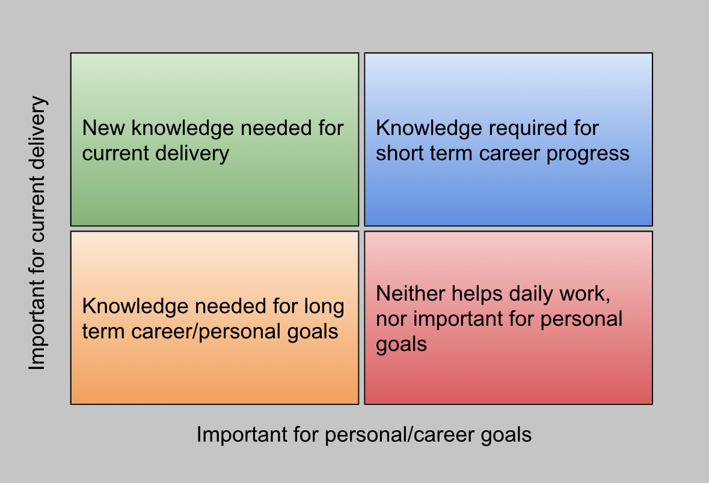

An important thing I learned this week:

> I need to prioritise my learnings!

Last night I started reading [The Science of Rapid Skill Acquisition](https://www.amazon.co.uk/Science-Rapid-Skill-Acquisition-Information-ebook/dp/B07NS6QNSR), which made me realise that I had too much on my plate in the last six-seven months. I learned Python and [Flask](https://flask.palletsprojects.com/en/1.1.x/), Java and [Spring](https://spring.io/), later [React](https://reactjs.org/), [Node.js](https://nodejs.org/en/) and [Gatsby](https://www.gatsbyjs.com/). Besides these technical skills, I spent some time teaching myself the Mandarin(Chinese) language, hoping one day I'll be able to chat with my in-laws. Also, reading books to improve my interpersonal/people skills, for instance: [Better Small Talk](https://www.goodreads.com/book/show/53512231-better-small-talk) and [How to Win Friends and Influence People in the Digital Age](https://www.amazon.co.uk/How-Friends-Influence-People-Digital/dp/085720727X).

Although I managed to gain a shallow knowledge on many of these areas, it is needless to say: I have not mastered any of them. In my defence, moving from one project to another caused some focus shift, which is just the nature of being a consultant and a generalist. Now I found myself in a position where mastering one area may help my career progress a bit better. I decided to use a matrix to prioritise my learning goals.

The matrix I created is similar to the [Eisenhower Matrix](https://www.eisenhower.me/eisenhower-matrix/), which prioritises the most important tasks and eliminates the least important ones. The biggest flaw I can see is the idea of maximising productivity so that non-productive "tasks", such as playing video games or surfing the internet, should be stopped. I believe those activities could live outside the scope of the matrix since we are human, 100% productivity is not feasible, time to times, you need to recharge your batteries.

Now, back to my learning matrix:

The most important knowledge that can help my day to day work goes to the top left corner, while things that neither helps daily work nor important for personal goals can sit at the bottom right of the matrix. And between the knowledge that can help short and long term career/personal goals.

I have decided to learn more about [AWS](https://aws.amazon.com/) and eventually go for the [AWS Certified Developer - Associate](https://aws.amazon.com/certification/certified-developer-associate/) certification. I'm using AWS daily, and having a more profound knowledge could enable me contributing to architectural decisions, nonetheless progressing towards a more senior role. So here I come, this will be my main focus from next week.
